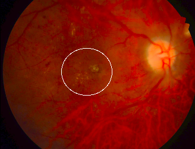
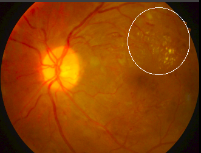
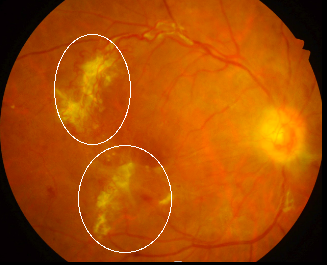

# Diabetic Retinopathy Classification
This project aims to build a Diabetic Retnipathy classifier using neural networks while verifying our model using GRAD-CAM.
# Visulization Motivation
using visualization technique we can verify if our model attend to important parts (lesions) in our medical image and also this provides more interpretation and verification to doctors doubting the model Results
# Dataset
A collection of the different datasets collected from Kaggle was used to train and test the visualization performance of the model.
 
# Visualization Results
 
our qualitative measures show interesting insights and shed light on new findings.

Using Grad-CAM we managed to highlight important regions in the image that contributed to our model classification result.

<h2 align="center" >Success Casses</h2>

  
  

  
  

 - in the two examples shown above the model misclassified both of them but only by a one level, fig 1 model predict 4 but ground truth is 3, and in the below, prediction 3 ground is  4
 
  -in other words since our problem is to classify the severity(0 to 4) if the model misclassify it by one level, it still can localize the lessions correctly sometimes.

<h2 align="center" >Failure Casses</h2>

  

  
  

- in this case, the model completely misclassifies the Fundus image giving it a label 0 instead of 4. And we can see that the visualization is completely inaccurate.

# Conclusion
- due to the nature of our problem, we can if the model misclassifies an image by only one level the visualization can still localize lesions most of the time.
- level 0 (normal) visualization is mostly messy there is no specific pattern that is found in the fundus image that leads to this classification, instead, it's the absence of the other patterns/lesions that caused this classification.